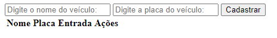
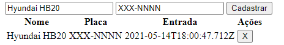
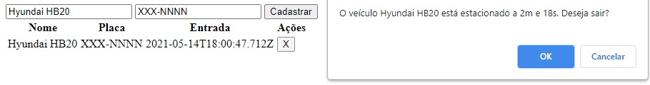

# DIO-ParkingLot
Projeto desenvolvido na Lab "Aprenda a criar um Sistema de Estacionamento usando TypeScript" da [Digital Innovation One](https://digitalinnovation.one).

O objetivo do projeto é ensinar as bases do TypeScript. Para isso, foi desenvolvido um sistema de estacionamento que guarda as informações sobre os veículos no *localStorage* do navegador.

## Instruções
Depois de obter o projeto na sua máquina local, abra uma janela de linha de comandos e acesse o diretório raíz do projeto.

Para gerar o `script.js` a partir do `script.ts`:
```bash
npx -p typescript tsc
```
Depois de fazer a transpilação para JavaScript, abra o `index.html`.

## Tecnlogias utilizadas
- HTML
- TypeScript

## Screenshots




